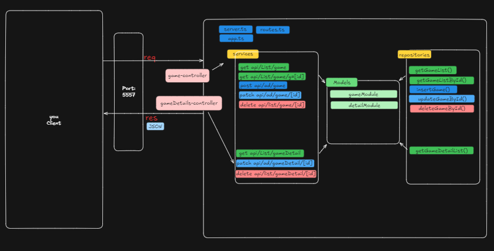
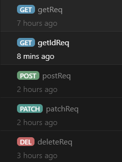

<h1>API de Jogos</h1>
Uma API RESTful construída com Express e TypeScript para gerenciar informações de jogos, incluindo detalhes sobre requisitos de sistema, DLCs e mais.

<h2>Arquitetura do Projeto</h2>

A arquitetura do projeto segue o modelo em camadas, organizando responsabilidades de forma clara. Abaixo está um diagrama representando a estrutura do projeto e a organização dos diretórios:

 

  
  <pre>
src/
├── contracts/     # Interfaces para contratos entre camadas
├── controllers/   # Manipuladores de requisições
├── repositories/  # Acesso a dados
├── services/      # Lógica de negócios
├── utils/         # Funções auxiliares
├── app.ts         # Configuração do Express
├── routes.ts      # Rotas da API
└── server.ts      # Ponto de entrada do servidor
  </pre>

## 🛠 Tecnologias

  
  
  
  

## 🔧 Dependências de Desenvolvimento

  
  
  

 
<h1>Endpoints da API</h1>

Exemplo de Requisições usando Thunder Client:

  
  

    
<strong>GET</strong> <code>/api/game</code> 
      Recupera todos os jogos.

    
<strong>GET</strong> <code>/api/game/{id}</code> 
      Recupera um jogo específico pelo ID.

    
<strong>GET</strong> <code>/api/game/Detail/{id}</code> 
      Visualiza os detalhes de um jogo pelo ID.

    
<strong>POST</strong> <code>/api/game</code> 
      Adiciona novos jogos ao sistema.

    
<strong>PATCH</strong> <code>/api/game/atuaz/{id}</code> 
      Atualiza informações específicas de um jogo pelo ID.

    
<strong>DELETE</strong> <code>/api/game/delete/{id}</code> 
      Remove um jogo do sistema pelo ID.

  

  

  

    <code>$ git clone https://github.com/usuario/repo.git</code>
    <button onclick="navigator.clipboard.writeText('git clone https://github.com/usuario/repo.git')" style="margin-left: 16px; background: none; border: none; cursor: pointer;">
      
    </button>
  

